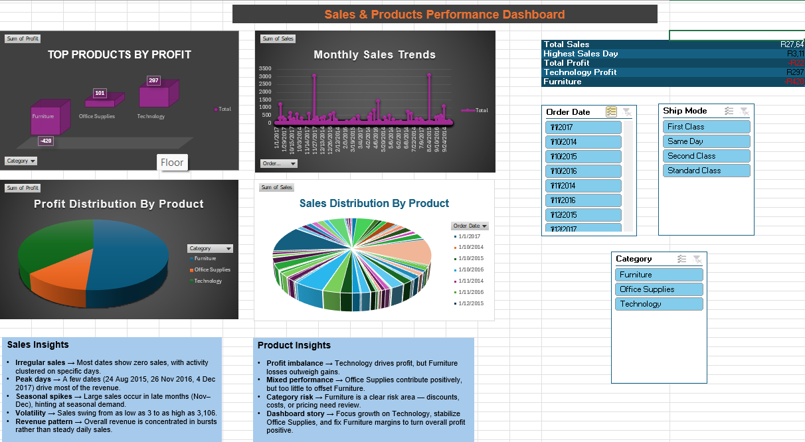

# FUTURE_DS_01

 **Sales & Products Performance Dashboard**

This project is part of the Data Science & Analytics track. It uses Excel PivotTables, slicers, and KPIs to analyze sales and product performance.

## Screenshot

## Features
- Monthly sales trends
- Product profit distribution
- Interactive slicers for category and year
- Insights commentary (Sales & Product)

## Key Insights
- Technology drives profit, but Furniture losses outweigh gains.
- Office Supplies contribute positively, but too little to offset Furniture.
- Furniture is a clear risk area — discounts, costs, or pricing need review.
- Focus growth on Technology, stabilize Office Supplies, and fix Furniture margins to turn overall profit positive.
